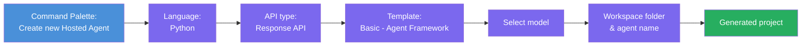
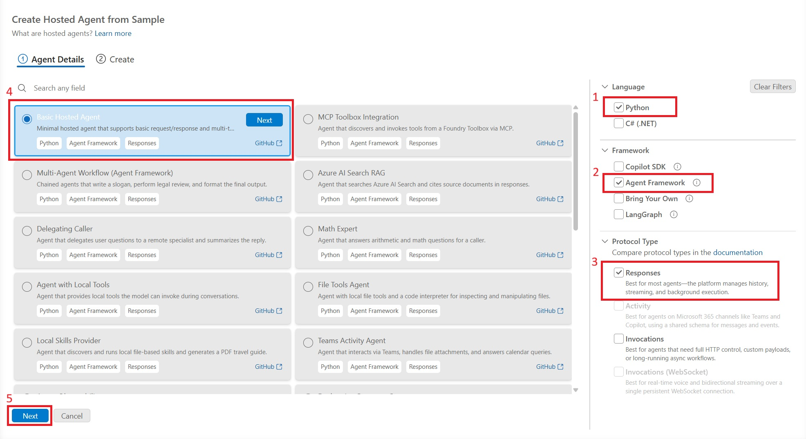
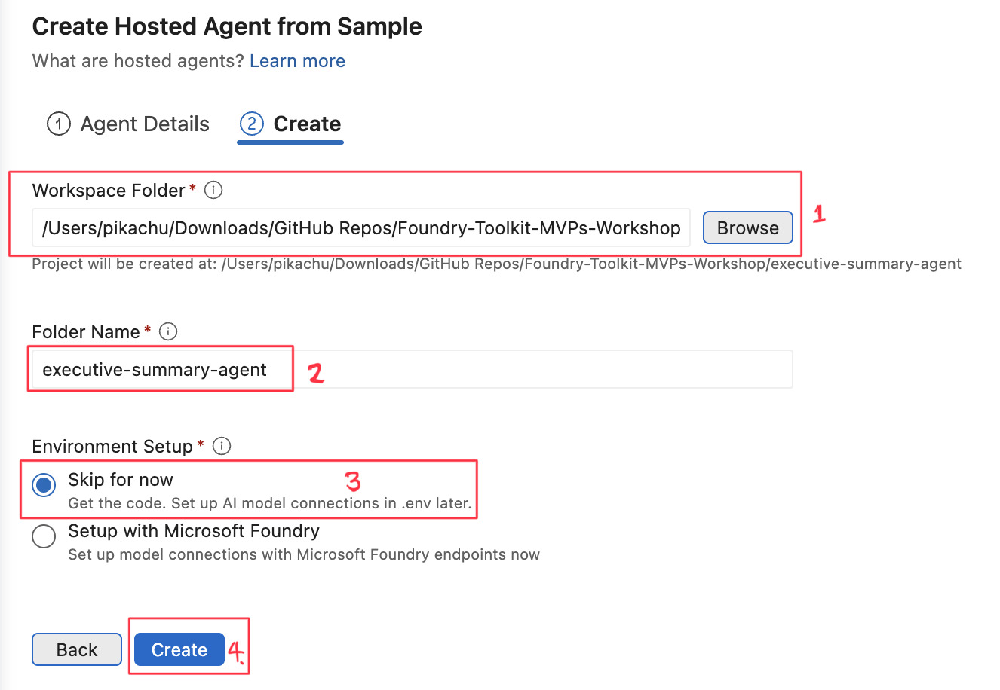

# Module 2 - Create a New Hosted Agent

⏱️ ~5 min

In this module, you use Foundry Toolkit to **scaffold a hosted agent project**. The scaffold generates the full project structure - `agent.yaml`, `main.py`, `Dockerfile`, `requirements.txt`, and VS Code debug configuration - so you can focus on customizing the agent's behavior.

> **Key concept:** The `agent/` folder in this lab is an example of what Foundry Toolkit generates. You don't write these files from scratch.

### Scaffold wizard flow



---

## Step 1: Open the Create Hosted Agent wizard

1. Press `Ctrl+Shift+P` to open the **Command Palette**.
2. Type: **Foundry Toolkit: Create new Hosted Agent** and select it.

> **Alternative: Create via Foundry Portal**
> If you prefer the browser, you can create your project at [https://ai.azure.com](https://ai.azure.com). Once the project is provisioned, return to VS Code and use the **Foundry Toolkit** sidebar to connect to it.

> **Alternative:** Click the **+** icon next to **Hosted Agents (Preview)** in the Foundry Toolkit sidebar.

## Step 2: Choose settings



1. On the left navigation/options section select the following:

| Menu | Selection | Notes |
|--------|-----------|-------|
| **Language** | Python | C# also supported |
| **Framework** | Agent Framework | Simple starting point using Agent Framework SDK |
| **API type** | Response API | `POST /responses` - conversational, with platform-managed history |
| **Template** | Basic | Simple starting point using Agent Framework SDK |

2. Once selected, click **Next**



3. In the next window, select the following:

| Menu | Selection | Notes |
|--------|-----------|-------|
| **Workspace folder** | Choose a target folder | e.g., `/workspace/Foundry_Toolkit_for_VSCode_Lab/` or a subfolder in this repo |
| **Agent name** | Enter a name | e.g., `executive-summary-agent` |
| **Environment Setup** | skip setup for now |  |

Click **create** to create our agent. A new folder will be created with the hosted agent name.

## Step 3: Inspect the generated project

After scaffolding completes, verify you see these files in the Explorer (`Ctrl+Shift+E`):

```
📂 EXECUTIVE-SUMMARY-AGENT/
├── .foundry/ 
├── .vscode/ 
├── src/ 
│ └── agent-framework-agent-basic-responses/ 
│       ├── .azdignore 
│       ├── .dockerignore 
│       ├── .env              ← Environment variables (placeholders)
│       ├── Dockerfile        ← Container config for deployment
│       ├── main.py           ← Agent entry point (your main code)
│       └── requirements.txt  ← Python dependencies
├── AGENTS.md 
├── azure.yaml                ← Agent definition (kind: hosted)
├── CLAUDE.md 
└── README.md
```

### Key files explained

| File | Purpose |
|---|---|
| `src/agent-framework-agent-basic-responses/main.py` | Agent entry point containing the main application and agent logic. |
| `src/agent-framework-agent-basic-responses/requirements.txt` | Defines the Python dependencies required by the agent application. |
| `src/agent-framework-agent-basic-responses/Dockerfile` | Defines the container configuration used to build and run the agent application. |
| `src/agent-framework-agent-basic-responses/.env` | Stores environment variables and local configuration used by the application. |
| `src/agent-framework-agent-basic-responses/.dockerignore` | Specifies files and directories that should be excluded from the Docker build context. |
| `src/agent-framework-agent-basic-responses/.azdignore` | Specifies files and directories that Azure Developer CLI (`azd`) should exclude during packaging or deployment. |
| `azure.yaml` | Defines the Azure Developer CLI project and service configuration used for deployment. |
| `AGENTS.md` | Provides project-level instructions and context for AI coding agents working with the repository. |
| `CLAUDE.md` | Provides project-specific instructions and context for Claude-based development workflows. |
| `README.md` | Contains the main project documentation, setup instructions, and usage information. |

> **Note:** The agent application files now live under `src/agent-framework-agent-basic-responses/` rather than directly in the project root.

---

### ✅ Checkpoint

- [ ] Scaffolded project created with all expected files
- [ ] `agent.yaml` shows `kind: hosted` and `protocol: responses`
- [ ] `main.py` imports `Agent`, `FoundryChatClient`, `ResponsesHostServer`
- [ ] The agent folder is open in VS Code as the workspace root

---

**Previous:** [01 - Setup](01-setup.md) · **Next:** [03 - Configure & Code →](03-configure-and-code.md)
