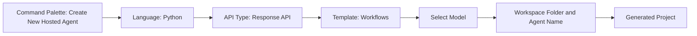
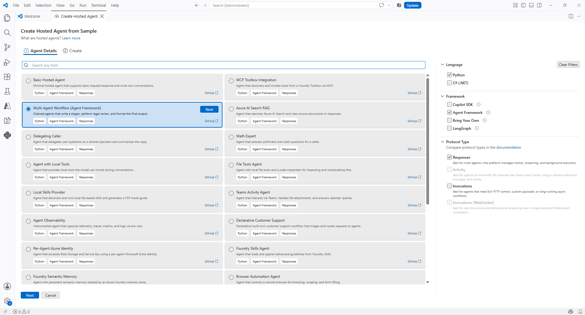
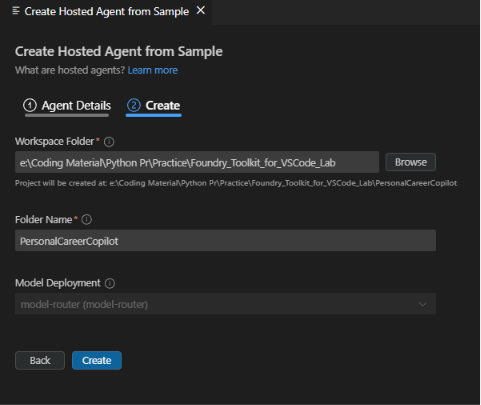

# Module 2 - Scaffold the Multi-Agent Project

⏱️ ~5 min

In this module, you use [Foundry Toolkit for VS Code](https://aka.ms/foundrytk) to **scaffold a multi-agent project**. The wizard generates `agent.yaml`, `main.py`, `Dockerfile`, `requirements.txt`, `.env`, and VS Code debug configuration - so you can focus on wiring the 4-agent workflow in Module 3.

> **Key concept:** The scaffold is a working stub with one agent. You replace the placeholder logic with the `WorkflowBuilder` graph in Module 3. You don't write the boilerplate from scratch.

> **Reference implementation:** [`PersonalCareerCopilot/`](../PersonalCareerCopilot/) is a complete working example. Use it to compare your work as you go.

### Scaffold wizard flow



---

## Step 1: Open the Create Hosted Agent wizard

1. Press `Ctrl+Shift+P` to open the **Command Palette**.
2. Type: **Foundry Toolkit: Create a New Hosted Agent** and select it.
3. The wizard opens on the **Agent Details** tab.

> **Alternative:** Click the **Foundry Toolkit** icon in the Activity Bar → click the **+** icon next to **Hosted Agents** → **Create New Hosted Agent**.

---

## Step 2: Choose settings



1. On the left navigation/options section select the following:

| Menu | Selection | Notes |
|--------|-----------|-------|
| **Language** | Python | C# (.NET) also supported |
| **Framework** | Agent Framework | Provides `Agent`, `AgentExecutor`, `WorkflowBuilder` |
| **API type** | Response API | `POST /responses` - platform-managed history, streaming support |
| **Template** | **Multi-Agent Workflow (Agent Framework)** | Processes requests through multiple agents in sequence |

2. Once selected, click **Next**



3. In the next window, select the following:

| Menu | Selection | Notes |
|--------|-----------|-------|
| **Workspace folder** | Browse to target folder | e.g., `workshop/lab02-multi-agent/` in this repo |
| **Agent name** | `PersonalCareerCopilot` | This becomes the project directory name |
| **Model Deployment** | Select your deployed model | e.g., `gpt-4.1-mini` from Lab 01 |

4. Click **Create** to scaffold the project. VS Code generates the files and opens the folder.

> **Tip:** [`gpt-4.1-mini`](https://learn.microsoft.com/azure/foundry/foundry-models/concepts/models-sold-directly-by-azure#gpt-41-series) balances speed and quality well for multi-agent development.

---

## Step 3: Inspect the generated project

After scaffolding completes, verify you see these files in the Explorer (`Ctrl+Shift+E`):

```text
📂 PersonalCareerCopilot/
├── .foundry/
│   └── .deployment.json    ← Azure AI Foundry deployment configuration
├── .vscode/
│   ├── launch.json         ← Debug configuration (F5 → run + Agent Inspector)
│   └── tasks.json          ← VS Code task definitions
├── src/
│   └── agent-framework-workflows-responses/
│       ├── .azdignore      ← Files excluded from Azure Developer CLI deployments
│       ├── .dockerignore   ← Files excluded from Docker builds
│       ├── .env            ← Environment variables (placeholders - fill in Module 3)
│       ├── Dockerfile      ← Container configuration for deployment
│       ├── main.py         ← Stub agent entry point (replace with WorkflowBuilder in Module 3)
│       └── requirements.txt ← Python dependencies
├── AGENTS.md               ← Agent/project guidance and instructions
├── azure.yaml              ← Azure Developer CLI (azd) project configuration
├── CLAUDE.md               ← Claude-specific project guidance
└── README.md               ← Project documentation
```

> **Important:** Open the `PersonalCareerCopilot` project folder directly in VS Code so that the root-level `.vscode/launch.json` and `.vscode/tasks.json` configurations apply correctly for F5 debugging.

### Key files explained

| File | Purpose |
|------|---------|
| `.foundry/.deployment.json` | Stores Azure AI Foundry deployment configuration and metadata |
| `.vscode/launch.json` | Defines the VS Code F5 debugging configuration, including launching the agent and Agent Inspector |
| `.vscode/tasks.json` | Defines supporting VS Code tasks used during local development and debugging |
| `src/agent-framework-workflows-responses/main.py` | Stub agent entry point. Replace the scaffolded implementation with 4 agents + `WorkflowBuilder` in Module 3 |
| `src/agent-framework-workflows-responses/Dockerfile` | Container configuration for the hosted agent deployment |
| `src/agent-framework-workflows-responses/requirements.txt` | Python dependencies required by the agent application |
| `src/agent-framework-workflows-responses/.env` | Local environment variables and configuration placeholders |
| `src/agent-framework-workflows-responses/.azdignore` | Specifies files excluded from Azure Developer CLI deployments |
| `src/agent-framework-workflows-responses/.dockerignore` | Specifies files excluded from the Docker build context |
| `azure.yaml` | Defines the Azure Developer CLI (`azd`) project and deployment configuration |
| `AGENTS.md` | Contains repository-level instructions and guidance for AI coding agents |
| `CLAUDE.md` | Contains project guidance intended for Claude-based development workflows |
| `README.md` | Top-level project documentation and setup guidance |

> **Reference:** The agent implementation files are now located under `src/agent-framework-workflows-responses/`. See [`src/agent-framework-workflows-responses/main.py`](../PersonalCareerCopilot/src/agent-framework-workflows-responses/main.py) and [`src/agent-framework-workflows-responses/requirements.txt`](../PersonalCareerCopilot/src/agent-framework-workflows-responses/requirements.txt) for the generated agent content.

---

### ✅ Checkpoint

- [ ] Scaffold wizard completed - new project folder is visible in Explorer
- [ ] All expected files present: `agent.yaml`, `main.py`, `Dockerfile`, `requirements.txt`, `.env`
- [ ] `agent.yaml` shows `kind: hosted` and `protocol: responses`
- [ ] `main.py` imports `Agent`, `FoundryChatClient`, `ResponsesHostServer`
- [ ] Scaffolded folder is open as the VS Code workspace root
- [ ] You understand `main.py` is a stub - `WorkflowBuilder` is added in Module 3

---

**Previous:** [01 - Understand Multi-Agent Architecture](01-understand-multi-agent.md) · **Next:** [03 - Configure Agents & Environment →](03-configure-agents.md)
