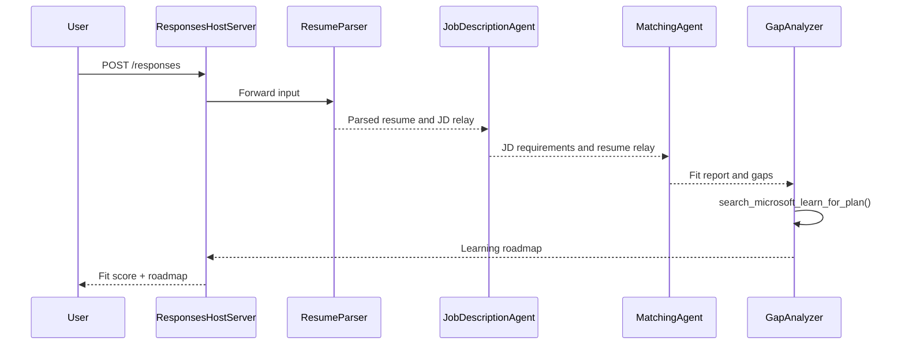

# Module 3 - Configure Instructions, Environment & Install Dependencies

⏱️ ~15 min

In this module, you transform the scaffolded stub into **your** multi-agent workflow - by setting environment variables, writing agent instructions, adding the MCP tool, wiring the workflow graph, and installing dependencies.

> **Reference:** The complete working code is in [`PersonalCareerCopilot/main.py`](../PersonalCareerCopilot/main.py). Use it as a reference while building your own workflow graph and prompt blocks.

---

## How the four agents fit together



---

## Step 1: Configure environment variables

1. Open the **`.env`** file in your project root (created by the scaffold wizard).
2. Replace the placeholders with your actual values from Lab 01.

<details open>
<summary><strong>🅰️ Path A - Foundry subscription</strong></summary>

```env
FOUNDRY_PROJECT_ENDPOINT=https://<your-account>.services.ai.azure.com/api/projects/<your-project>
AZURE_AI_MODEL_DEPLOYMENT_NAME=gpt-4.1-mini
```

> **Where to find values:** See [Lab 01, Module 1](../../lab01-single-agent/docs/01-setup.md#deploy-a-model--assign-rbac).

</details>

<details open>
<summary><strong>🅱️ Path B - Foundry Local</strong></summary>

```env
FOUNDRY_PROJECT_ENDPOINT=http://localhost:5273/v1
AZURE_AI_MODEL_DEPLOYMENT_NAME=phi-4-mini
```

> All inference runs on your machine - no data leaves your device. Run `foundry model list` to confirm the exact model alias. The only outbound request is the MCP tool call to `https://learn.microsoft.com/api/mcp`.

> **Where to find values:** See [Lab 01, Module 1 - local path](../../lab01-single-agent/docs/01-setup.md#step-2-set-up-based-on-your-access).

</details>

> **Security:** Never commit `.env` to version control. It should already be in `.gitignore`.

---

## Step 2: Write agent instructions

Instructions define each agent's role, output format, and rules. Open `main.py` and define (or replace) the four instruction constants - the complete strings are in [`PersonalCareerCopilot/main.py`](../PersonalCareerCopilot/main.py).

### 2.1 `RESUME_PARSER_INSTRUCTIONS`
Parses the resume into a structured candidate profile **and** copies the job description verbatim into `[JOB DESCRIPTION PASS-THROUGH]`. Both labeled sections must appear in the output.

> **Why the pass-through?** With `context_mode="last_agent"`, ResumeParser is the **only** agent that sees the original user message. If it doesn't copy the JD forward, the downstream agents never see it.

In `main.py`, add below:

```python
RESUME_PARSER_INSTRUCTIONS = """\
You are the Resume Parser and Content Router.
Your input contains a resume and usually a job description - BOTH must be preserved.

TASK 1 - Parse the resume into a structured candidate profile.
TASK 2 - Copy the job description verbatim into the pass-through section below.

Output EXACTLY these two labeled sections:

[PARSED RESUME]
1) Candidate Profile
2) Technical Skills (grouped categories)
3) Soft Skills
4) Certifications & Awards
5) Domain Experience
6) Notable Achievements

[JOB DESCRIPTION PASS-THROUGH]
<Copy the complete job description here exactly as given. Do NOT summarize or paraphrase.
If no job description is present, write only: No job description provided.>

Rules:
- Use only explicit or strongly implied evidence for the resume sections.
- Do not invent skills, titles, or experience.
- Keep resume bullets concise; no long paragraphs.
- The [JOB DESCRIPTION PASS-THROUGH] section MUST contain the FULL, UNMODIFIED JD text.
  Omitting or truncating it breaks the downstream Job Description Agent.
"""
```

### 2.2 `JOB_DESCRIPTION_INSTRUCTIONS`
Reads `[PARSED RESUME]` and `[JOB DESCRIPTION PASS-THROUGH]` from ResumeParser output. Outputs `[JD REQUIREMENTS]` (structured requirements) and `[PARSED RESUME PASS-THROUGH]` (verbatim resume copy for MatchingAgent).

In `main.py`, add below:

```python
JOB_DESCRIPTION_INSTRUCTIONS = """\
You are the Job Description Analyst and Resume Relay.
Your input is the Resume Parser output. It contains two clearly labeled sections:
  - [PARSED RESUME] - copy this verbatim to [PARSED RESUME PASS-THROUGH] in your output.
  - [JOB DESCRIPTION PASS-THROUGH] - extract the structured JD requirements from here only.

Output EXACTLY these two labeled sections:

[JD REQUIREMENTS]
1) Role Overview
2) Required Skills
3) Preferred Skills
4) Experience Required
5) Certifications Required
6) Education
7) Domain / Industry
8) Key Responsibilities

[PARSED RESUME PASS-THROUGH]
<Copy the complete [PARSED RESUME] section here exactly as given. Do NOT summarize or paraphrase.>

Rules:
- Extract requirements ONLY from [JOB DESCRIPTION PASS-THROUGH] - do not use [PARSED RESUME] content.
- Copy [PARSED RESUME] verbatim - the Matching Agent depends on it downstream.
- Keep required vs preferred clearly separated.
- Only use what the JD states; do not invent hidden requirements.
- Flag vague requirements briefly.
- If the JD pass-through says \"No job description provided\", write in [JD REQUIREMENTS]:
  \"No JD available - cannot extract requirements. Ask the user to re-submit with a job description.\"
"""
```

### 2.3 `MATCHING_AGENT_INSTRUCTIONS`
Reads `[JD REQUIREMENTS]` and `[PARSED RESUME PASS-THROUGH]`. Produces a scored fit report (0–100) with breakdown math, matched skills, missing skills, and experience alignment.

In `main.py`, add below:

```python
MATCHING_AGENT_INSTRUCTIONS = """\
You are the Matching Agent.
Your input is the Job Description Analyst output. It contains two clearly labeled sections:
  - [JD REQUIREMENTS] - the structured job requirements; use this as the target profile.
  - [PARSED RESUME PASS-THROUGH] - the candidate's parsed profile; use this as the candidate profile.

Compare [PARSED RESUME PASS-THROUGH] vs [JD REQUIREMENTS] and produce an evidence-based fit report.

Scoring (100 total):
- Required Skills 40
- Experience 25
- Certifications 15
- Preferred Skills 10
- Domain Alignment 10

Output exactly these sections:
1) Fit Score (with breakdown math)
2) Matched Skills
3) Missing Skills
4) Partially Matched
5) Experience Alignment
6) Certification Gaps
7) Overall Assessment

Rules:
- Be objective and evidence-only.
- Keep partial vs missing separate.
- Keep Missing Skills precise; it feeds roadmap planning.
"""
```

### 2.4 `GAP_ANALYZER_INSTRUCTIONS`
Reads the fit report. For **every** missing skill, calls `search_microsoft_learn_for_plan` to fetch Microsoft Learn resources. Produces one detailed gap card per skill plus a week-by-week learning roadmap.

In `main.py`, add below:

```python
GAP_ANALYZER_INSTRUCTIONS = """\
You are the Gap Analyzer and Roadmap Planner.
Create a practical upskilling plan from the matching report.

Microsoft Learn MCP usage (required):
- For EVERY High and Medium priority gap, call tool `search_microsoft_learn_for_plan`.
- Use returned Learn links in Suggested Resources.
- Prefer Microsoft Learn for free resources.

CRITICAL: You MUST produce a SEPARATE detailed gap card for EVERY skill listed in
the Missing Skills and Certification Gaps sections of the matching report. Do NOT
skip or combine gaps. Do NOT summarize multiple gaps into one card.

Output format:
1) Personalized Learning Roadmap for [Role Title]
2) One DETAILED card per gap (produce ALL cards, not just the first):
   - Skill
   - Priority (High/Medium/Low)
   - Current Level
   - Target Level
   - Suggested Resources (include Learn URL from tool results)
   - Estimated Time
   - Quick Win Project
3) Recommended Learning Order (numbered list)
4) Timeline Summary (week-by-week)
5) Motivational Note

Rules:
- Produce every gap card before writing the summary sections.
- Keep it specific, realistic, and actionable.
- Tailor to candidate's existing stack.
- If fit >= 80, focus on polish/interview readiness.
- If fit < 40, be honest and provide a staged path.
"""
```

---

## Step 3: Add the MCP tool

The GapAnalyzer calls the [Microsoft Learn MCP server](https://learn.microsoft.com/azure/foundry/agents/how-to/tools/model-context-protocol) to fetch real learning resources for each skill gap. The full `search_microsoft_learn_for_plan` function is in [`PersonalCareerCopilot/main.py`](../PersonalCareerCopilot/main.py).

Register the tool on the GapAnalyzer when creating the agent:

```python
MICROSOFT_LEARN_MCP_ENDPOINT = os.getenv(
    "MICROSOFT_LEARN_MCP_ENDPOINT", "https://learn.microsoft.com/api/mcp"
)

@tool
async def search_microsoft_learn_for_plan(
    skill: str, role: str = "", max_results: int = 5
) -> str:
    """Search Microsoft Learn MCP and return curated official links for roadmap planning."""
    query = " ".join(part for part in [skill, role, "learning path module"] if part).strip()
    query = query or "job skills learning path"

    try:
        async with streamable_http_client(MICROSOFT_LEARN_MCP_ENDPOINT) as (
            read_stream,
            write_stream,
            _,
        ):
            async with ClientSession(read_stream, write_stream) as session:
                await session.initialize()
                result = await session.call_tool(
                    "microsoft_docs_search", {"query": query}
                )

        if not result.content:
            return "No results returned. Fallback: https://learn.microsoft.com/training/support/catalog-api"

        payload_text = getattr(result.content[0], "text", "")
        data = json.loads(payload_text) if payload_text else {}
        items = data.get("results", [])[:max(1, min(max_results, 10))]

        if not items:
            return (
                f"No Microsoft Learn results for '{skill}'. "
                "https://learn.microsoft.com/training/support/integrations-learn-platform-api-catalog-quickstart"
            )

        lines = [f"Microsoft Learn resources for '{skill}':"]
        for i, item in enumerate(items, start=1):
            title = item.get("title") or "Microsoft Learn Resource"
            url = item.get("contentUrl") or item.get("url") or item.get("link") or ""
            lines.append(f"{i}. {title} - {url}".rstrip(" -"))
        return "\n".join(lines)
    except Exception as ex:
        return f"Microsoft Learn MCP unavailable ({ex}). See: https://learn.microsoft.com/api/mcp"

```

Update the `main` code as follows:

```python
resume_parser = Agent(client=client, instructions=RESUME_PARSER_INSTRUCTIONS, name="ResumeParser")
jd_agent = Agent(client=client, instructions=JOB_DESCRIPTION_INSTRUCTIONS, name="JobDescriptionAgent")
matching_agent = Agent(client=client, instructions=MATCHING_AGENT_INSTRUCTIONS, name="MatchingAgent")
gap_analyzer = Agent(
    client=client,
    instructions=GAP_ANALYZER_INSTRUCTIONS,
    name="GapAnalyzer",
    tools=[search_microsoft_learn_for_plan],
)

resume_executor = AgentExecutor(resume_parser, context_mode="last_agent")
jd_executor = AgentExecutor(jd_agent, context_mode="last_agent")
matching_executor = AgentExecutor(matching_agent, context_mode="last_agent")
gap_executor = AgentExecutor(gap_analyzer, context_mode="last_agent")

workflow_agent = (
    WorkflowBuilder(
        start_executor=resume_executor,
        output_executors=[gap_executor],
    )
    .add_edge(resume_executor, jd_executor)
    .add_edge(jd_executor, matching_executor)
    .add_edge(matching_executor, gap_executor)
    .build()
    .as_agent()
)

server = ResponsesHostServer(workflow_agent)
server.run()
```

> See [`PersonalCareerCopilot/main.py`](../PersonalCareerCopilot/main.py) for the complete `WorkflowBuilder` graph with `FoundryChatClient`, `AgentExecutor`, and all `add_edge()` calls.

---

## Step 4: Create virtual environment & install dependencies

> ⚠️ **Do not skip this step.** Without dependencies installed, F5 debugging will fail.

### 4.1 Create the virtual environment

```powershell
python -m venv .venv
```

### 4.2 Activate it

| OS | Command |
|----|---------|
| **Windows (PowerShell)** | `.\.venv\Scripts\Activate.ps1` |
| **Windows (CMD)** | `.venv\Scripts\activate.bat` |
| **macOS / Linux** | `source .venv/bin/activate` |

You should see `(.venv)` in your terminal prompt.

### 4.3 Install dependencies

```powershell
pip install -r requirements.txt
```

### 4.4 Verify

```powershell
pip list | Select-String "agent-framework|mcp|debugpy"
```

Expected: `agent-framework-foundry`, `agent-framework-foundry-hosting`, `mcp`, and `debugpy` are listed.

---

## Step 5: Verify authentication

<details open>
<summary><strong>🅰️ Path A - Azure credential</strong></summary>

```powershell
az account show --query "{name:name, id:id}" --output table
```

If this fails, run [`az login`](https://learn.microsoft.com/cli/azure/authenticate-azure-cli-interactively).

All four agents share one `FoundryChatClient` and one `DefaultAzureCredential`. If authentication works for one, it works for all.

</details>

<details open>
<summary><strong>🅱️ Path B - Foundry Local</strong></summary>

No authentication required for local testing.

</details>

---

### ✅ Checkpoint

> Do **not** proceed to Module 04 until: **(1)** `(.venv)` is visible in your prompt AND **(2)** `pip install -r requirements.txt` completed successfully.

- [ ] `.env` has valid endpoint and model deployment name (not placeholders)
- [ ] All 4 agent instruction constants defined in `main.py` (ResumeParser, JD Agent, MatchingAgent, GapAnalyzer)
- [ ] `search_microsoft_learn_for_plan` MCP tool defined and registered on GapAnalyzer
- [ ] `FoundryChatClient` + 4 `Agent` + 4 `AgentExecutor` objects created in `main()`
- [ ] `WorkflowBuilder` builds the correct sequential graph with all 3 `add_edge()` calls
- [ ] Virtual environment created and activated (`(.venv)` visible in prompt)
- [ ] `pip install -r requirements.txt` completed without errors
- [ ] **Path A:** `az account show` succeeds OR VS Code Accounts icon shows signed-in account

---

**Previous:** [02 - Scaffold Multi-Agent Project](02-scaffold-multi-agent.md) · **Next:** [04 - Orchestration Patterns →](04-orchestration-patterns.md)
